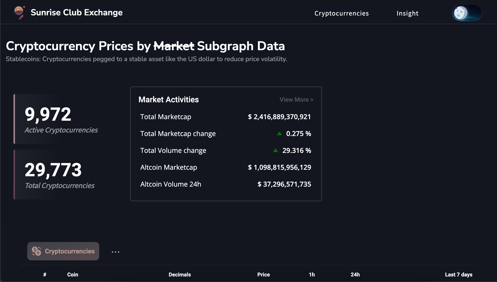
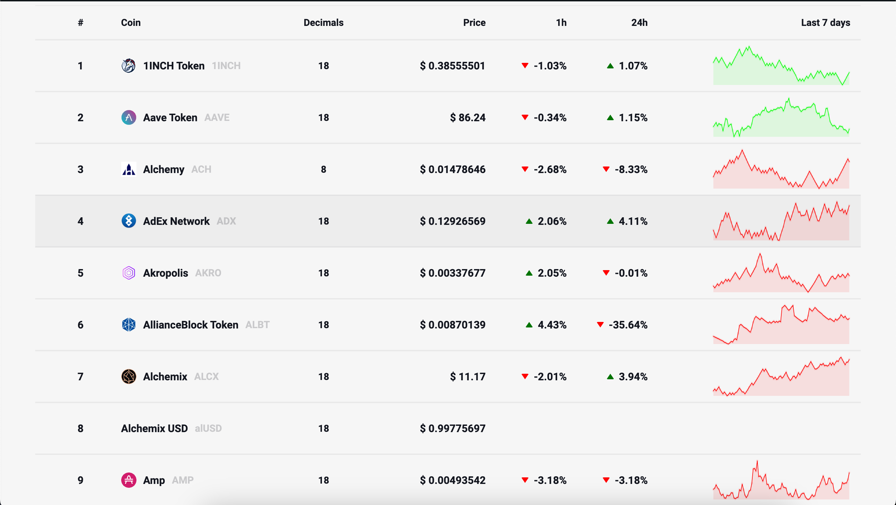
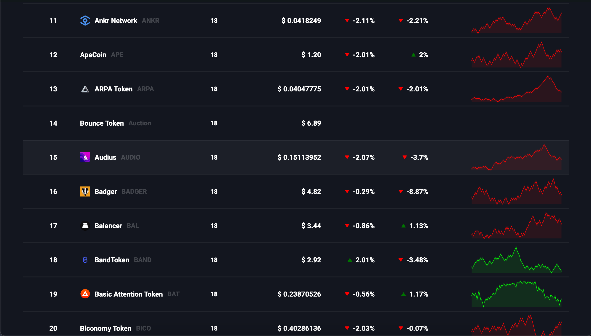

<div id="header" align="center">
  
  <h1>Sunrise Exchange Club</h1>
</div>

<div align="left">
    <h4>
        hey there 
        
    </h4>
    <h4>
        welcome to the Sunrise Exchange Club where you see the performance of your favorite crypto sourced from Chainlink and The Graph.
        <a href="#live-version">Dive in</a> and see what we offer.
    </h4>
</div>

#### Table of Content

- [Getting Started](#getting-started)
- [Inside the App](#inside-the-app-)
- [Live Version](#live-version)

## Getting Started

First, run the development server:

```bash
npm run dev
# or
yarn dev
# or
pnpm dev
# or
bun dev
```

Open [http://localhost:3000](http://localhost:3000) with your browser to see the result.

## Inside the App 🥽

#### Real time data of the Crypto market

<div id="center">
    
</div>

#### See the price of your favorite crypto powered by Chainlink X Subgraphs

<div align="center">
    
    
</div>

## Live Version
